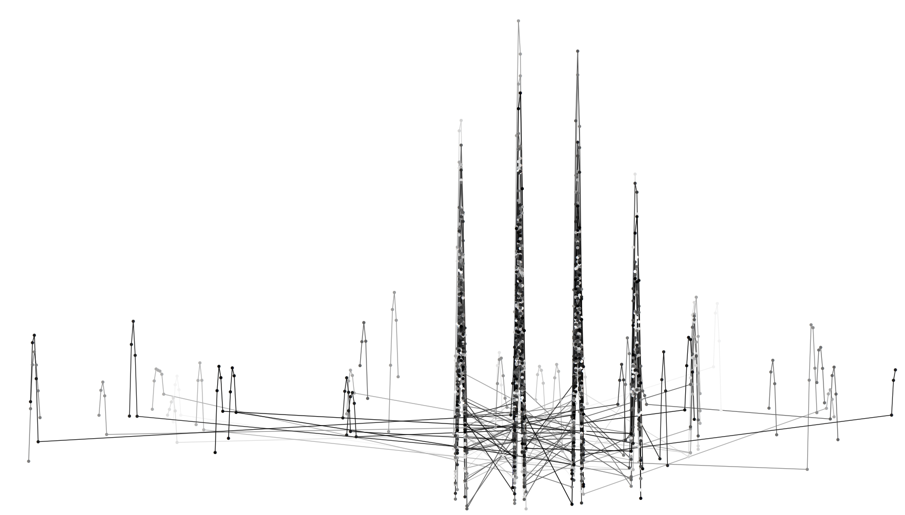

```{r setup, include=FALSE}
knitr::opts_chunk$set(echo = TRUE)
```

<style>
  body {
    text-align: justify
  }
</style>




Welcome to my webpage! 

I am a PHD at the University of Warsaw, [Department of Mathematics, Informatics and Mechanics](https://www.mimuw.edu.pl). 

I am chiefly interested in **Computational Mass Spectrometry**.

Under the guidance of my tutors, [prof. Anna Gambin](https://www.mimuw.edu.pl/~aniag/) and [Błażej Miasojedow](https://mimuw.wikispaces.com/Miasojedow,+Błażej), 
I have been developing algorithms and workflows for the analysis of mass spectrometric data. 
More specifically, we are interested in the study of mass spectra obtained with the use of Electron Transfer Reaction.  


For our analysis, we use the very best of Belgian data, as provided by the team of experts from the [Centre for Proteomics](https://www.uantwerpen.be/en/research-and-innovation/research-at-uantwerp/core-facilities/core-facilities/centre-for-proteomics/). 

The above graphic is a mass spectrum, incidentally, yet intentionally, plotted in a wrong way. It shows all we love and hate about Science. But maybe not, no, not really. It looks cool, though.


<!-- Some of my projects include: -->


<!-- * MassTodonPy -->
<!-- * IsoSpec -->


<!-- <table class='container'><tr> -->
<!-- <td> -->
<!-- [MassTodonPy](https://matteolacki.github.io/MassTodonPy/) -->
<!-- </td> -->
<!-- <td> -->
<!-- [IsoSpec](http://matteolacki.github.io/IsoSpec/) -->
<!-- </td> -->
<!-- </tr></table> -->


<!--  -->


<!-- ```{r cars} -->
<!-- summary(cars) -->
<!-- ``` -->

<!-- ## Including Plots -->

<!-- You can also embed plots, for example: -->

<!-- ```{r pressure, echo=FALSE} -->
<!-- plot(pressure) -->
<!-- ``` -->

<!-- Note that the `echo = FALSE` parameter was added to the code chunk to prevent printing of the R code that generated the plot. -->
