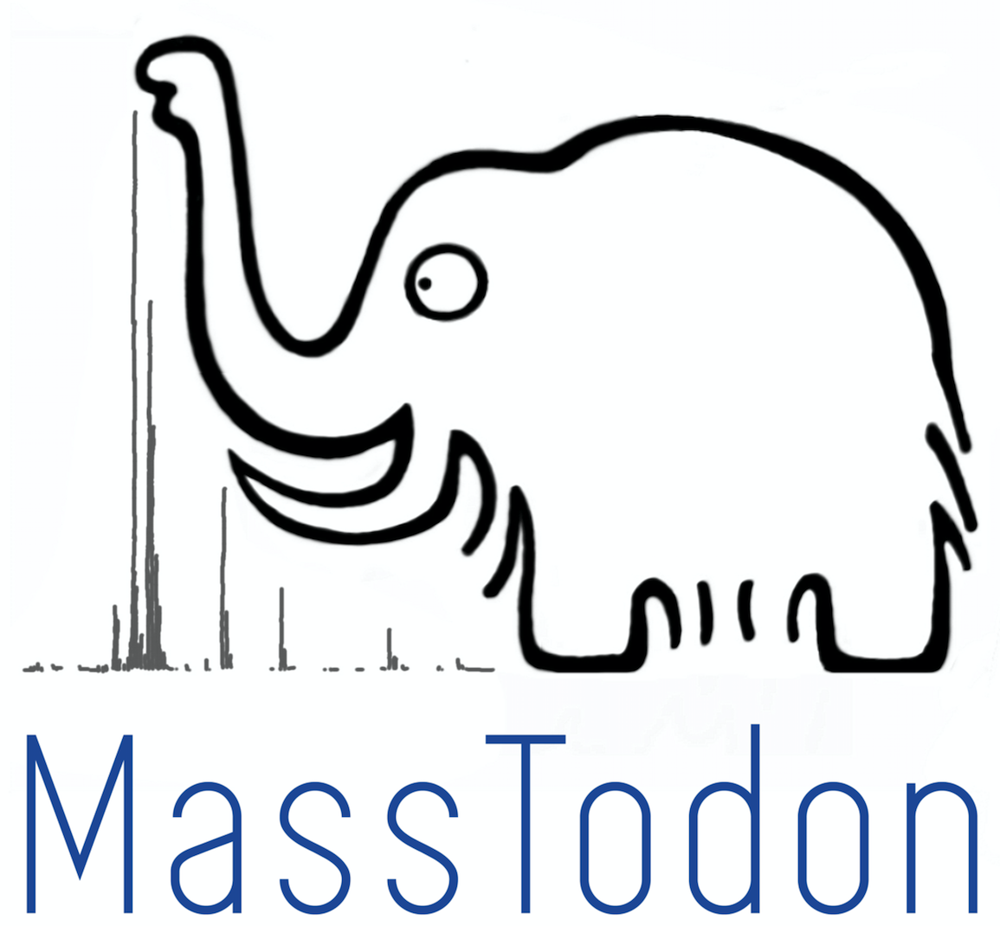
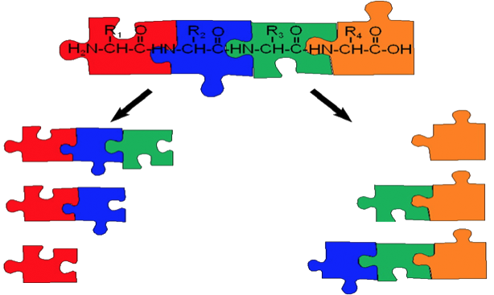
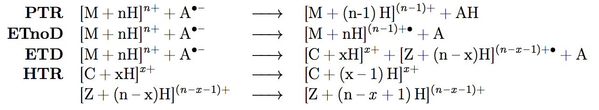

<style>
  body {
    text-align: justify
  }
</style>



<br><br><br><br>

# Briefing

This is a joint project with the [Centre for Proteomics](https://www.uantwerpen.be/en/research-and-innovation/research-at-uantwerp/core-facilities/core-facilities/centre-for-proteomics/) and could not have existed without Frederik Lermyte, Frank Sobott and Dirk Valkenborg.

The projects' main aim is to study the [electron transfer induced dissociation](http://wikipedia.moesalih.com/Electron_transfer_dissociation), or ETD for short. This is a mass spectrometric technique used to fragment the sample molecules. Why to do it? Frederik, whose a biochemists (running on biofuel, hahaha), would tell you one thing: there is a lot of reason for it! 

If you would like to study [post translational modifications](http://wikipedia.moesalih.com/Post-translational_modifications) you might have wanted to know where such a modification occured along the protein. Otherwise, you would not know what would be its relevance for the tertiary structure. But how could you know, where the modification occured, if you only knew the mass over charge ratio of the molecule? **You wouldn't!** That is why you would like to fragment the molecule, and use some of Frederik's favourite figures...

<center>

</center>

As shown above, the fragmentation of the molecule can already give you much more information: if the modification happened on one amino acid, then some of the produced fragments would be different than if they were coming from an unmodified molecule. Some would remain the same. If all of them appeared, you might have been able to dicepher the position of the molecule. The more fragments you see, the more information you would get. 

Alas, in the real world ideals fall apart, and you might not get a universal coverage. *Why is that?* Well, larger proteins have simply a complicated tertiary (3D) structure and some fragments might not show up. You might think it's an error, but in fact it is a feature, as it lets you investigate the tertiary structure.

To do all this, we must go back to the drawing board. The ETD is in fact a little complex and consist of cascades of reactions, dissociation being not the only outcome. There is a lot to happen:



PTR, or [proton transfer reaction](http://wikipedia.moesalih.com/Proton-transfer-reaction_mass_spectrometry), transfers the proton *the other way round*, from cation to anion. ETnoD is like ETD but without any fragmentation. ETD fragments the molecule into different c and z fragments, and, if followed by hydrogen transfer, results in *what we call* HTR. What is more, like Zergs, these reactions *keep on coming*, and one cation can be hit many times by anion and undergo one of the above reactions.

# Enter MassTodon

MassTodon is our wooly response to the unforgiving cold of all these weeks you had to stay in lab alone to assign all the possible ETD peaks. MassTodon finds fragments, deconvolves their isotopic envelopes (using IsoSpec), and summarizes the mass spectrum by a series of easily interpretable parameters.

If you are really interested, have a peep at it at [arXiv](https://arxiv.org/abs/1708.00234), where we describe in details how the whole approach works. If you are interested in testing it out first, we got this covered too, as you can [download the software and use it for free](https://matteolacki.github.io/MassTodonPy/).

But maybe you want some incentive first? A scooby snack of some kind that could show you that it might be useful. Well, here's the algorithm's outcome for a 3+ [Substance P](http://wikipedia.moesalih.com/Substance_P) mass spectrum acquired on a Synapt instrument:

```{r, echo=FALSE, message=FALSE, warning=FALSE, cache=FALSE, fig.align='center'}
library(rbokeh)
library(tidyverse)

make_spectrum_plot = function(path_to_data){
  D = read_csv( paste0(path_to_data, '/long.csv') )
  S = read_csv( paste0(path_to_data, '/short.csv') ) 
  R = read_csv( paste0(path_to_data, '/remaining_peaks.csv') ) 
  
  S = S %>% 
    mutate( key = paste(mz_L,mz_R)) %>%
    group_by(key) %>%
    summarize( 
      mz_L = first(mz_L),
      mz_R = first(mz_R),
      tot_intensity = round(sum(tot_intensity)),
      tot_estimate  = round(sum(tot_estimate))
    ) %>%
    mutate( mz_R = (mz_L+mz_R)/2 ) %>%
    filter( tot_intensity > 0 | tot_estimate > 0 )
  
  
  D = D %>%   
    drop_na() %>%
    mutate( key = paste(mz_L,mz_R),
            mz_L= (mz_L+mz_R)/2,
            estimate = round(estimate) ) %>%
    filter( estimate > 0 )
  
  R = R %>%
    mutate( tot_intensity = round(tot_intensity) ) %>%
    filter( tot_intensity > 0 )
  
  base_plot = 
    figure(
      width = 900,
      height= 500,
      title = "Wave Height = 150, Wave Velocity = 1750"
    )  %>%
    ly_rect(
      data    = D,
      xleft   = mz_L,
      xright  = mz_R,
      ybottom = 0,
      ytop    = tot_estimate_tmp,
      hover   = "m/z = [@mz_L,@mz_R] >> [@molType + @g]^{@q+} = @estimate",
      color   = 'red'
    ) %>%
    ly_rect(
      data    = S,
      xleft   = mz_L,
      xright  = mz_R,
      ybottom = 0,
      ytop    = tot_intensity,
      hover   = "m/z = [@mz_L,@mz_R]  >> @tot_intensity",
      color   = 'black'
    ) %>%
    ly_rect(
      data    = R,
      xleft   = mz_L,
      xright  = mz_R,
      ybottom = 0,
      ytop    = tot_intensity,
      hover   = "m/z = [@mz_L,@mz_R]  >> @tot_intensity",,
      color   = 'grey'
    ) %>%
    x_axis(label = "m/z") %>%
    y_axis(label = "Intensity")
  base_plot
}

make_spectrum_plot('21_WH-150_WV-1750')
```

About 60% of this spectrum can be explained using the product of the above reactions alone. In the region that can be explained, MassTodon's predictions cover around 85% of the peaks. This is done in under a second, leaving you enough time to close your eyes, open them, and be amazed.

In fact, the project sparked interest of at least one detective: the ETDetective.
